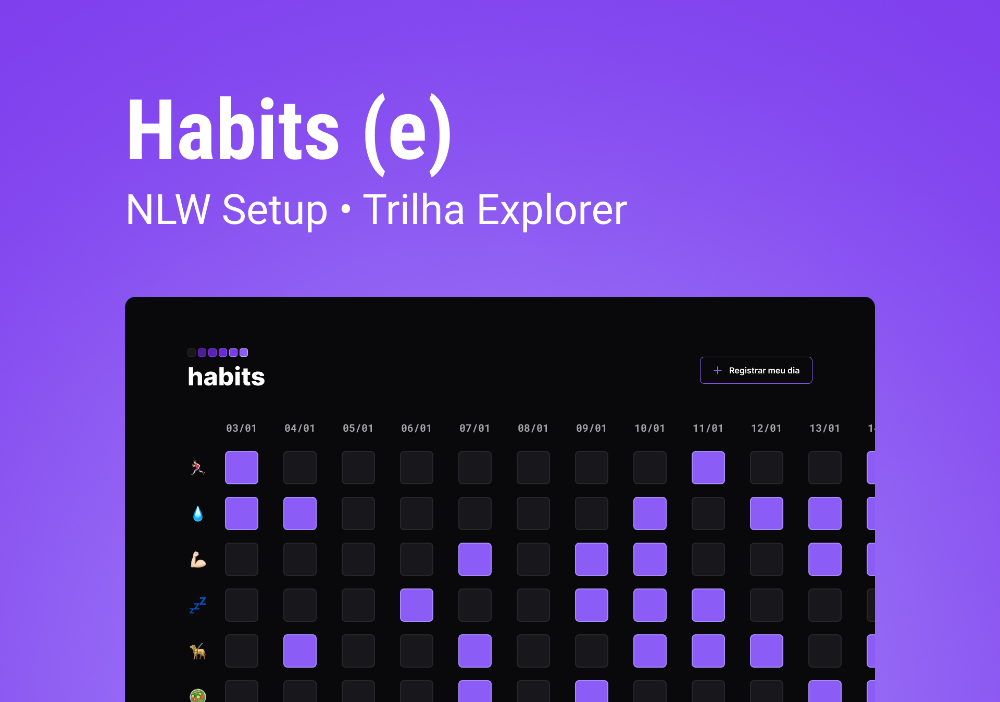

<h1 align="center"> Habits </h1>

Aplicação WEB feita para organização e comprometimento com os hábitos do cotidiano (Baseado no projeto original feito pela Rocketseat para o NLWSetup 2023).  

  <a href="#-tecnologias">Tecnologias</a>&nbsp;&nbsp;&nbsp;|&nbsp;&nbsp;&nbsp;
  <a href="#-projeto">Projeto</a>&nbsp;&nbsp;&nbsp;|&nbsp;&nbsp;&nbsp;
  <a href="#-layout">Layout</a>&nbsp;&nbsp;&nbsp;|&nbsp;&nbsp;&nbsp;
  <a href="#memo-licença">Licença</a>

  

 

  

## 🚀 Tecnologias

Esse projeto foi desenvolvido com as seguintes tecnologias:

- HTML5 e CSS3
- JavaScript (Incluindo a biblioteca NLWSetup) e um pouco de JSON
- Git e Github
- Figma

## 💻 Projeto

O Habits basicamente é um simples registro das atividades diárias do usuário para monitorar seus hábitos cotidianos.

## 🔖 Layout

Você pode visualizar o layout do projeto através [DESSE LINK](<https://www.figma.com/file/G5TAtRJdIkpLKOVEtvqahW/Habits-(e)-(Community)?node-id=6%3A344&t=BjMDFnNNVaCCAUnJ-0>). É necessário ter conta no [Figma](https://figma.com) para acessá-lo.

## Licença

Esse projeto está sob a licença MIT.

---
